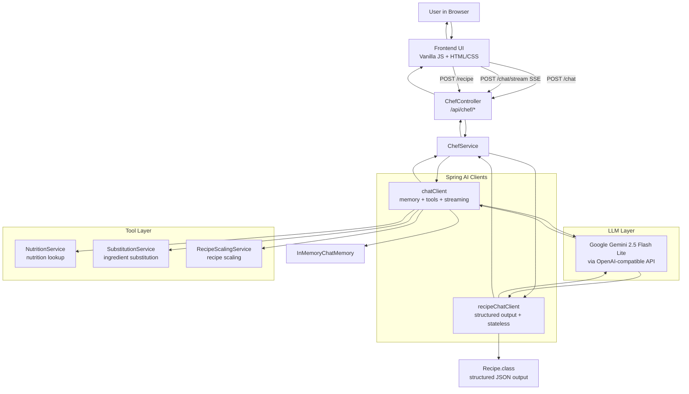

# Chef Claude — AI-Powered Recipe Assistant

An intelligent cooking assistant built with **Spring AI** and **Google Gemini**, demonstrating real-world LLM integration patterns: streaming responses, structured output extraction, function calling (tool use), and in-memory conversation memory.

> **Note:** Recipes are intentionally not persisted to a database. This application is a **Spring AI demo** — the focus is on showcasing LLM integration patterns, not data storage. Saved recipes live in the browser's `localStorage` for the duration of the session.

---

## Tech Stack

| Layer | Technology |
|---|---|
| Backend | Spring Boot 3.4.4, Java 22 |
| AI Framework | Spring AI 1.0.0-M6 |
| LLM | Google Gemini 2.5 Flash Lite (via OpenAI-compatible API) |
| Streaming | Server-Sent Events (SSE) with Project Reactor (`Flux`) |
| Frontend | Vanilla JS, HTML/CSS (single-file, no build step) |

---

## Spring AI Integration — How It Works

This project showcases four distinct Spring AI features working together.

### 1. ChatClient — Fluent LLM API

Spring AI's `ChatClient` is the central abstraction for interacting with any LLM. It's built once via a builder and reused across requests.

```java
// ChefService.java
this.chatClient = ChatClient.builder(chatModel)
    .defaultSystem(SYSTEM_PROMPT)
    .defaultAdvisors(new MessageChatMemoryAdvisor(new InMemoryChatMemory()))
    .defaultTools(nutritionLookup, ingredientSubstitution, recipeScaling)
    .build();
```

Two separate `ChatClient` instances serve different purposes:
- **`chatClient`** — conversational chat with memory and all three tools
- **`recipeChatClient`** — structured recipe generation with no memory (stateless, deterministic)

---

### 2. Streaming with Server-Sent Events

The chat endpoint streams tokens from Gemini to the browser in real time using Spring AI's reactive `Flux<String>` API.

```java
// ChefService.java
public Flux<String> chatStream(String userMessage) {
    return chatClient.prompt()
        .user(userMessage)
        .stream()
        .content();   // returns Flux<String> — one chunk per token
}
```

```java
// ChefController.java
@PostMapping(value = "/chat/stream", produces = MediaType.TEXT_EVENT_STREAM_VALUE)
public Flux<String> chatStream(@RequestBody ChatRequest request) {
    return chefService.chatStream(request.message());
}
```

The frontend reads the SSE stream and renders tokens progressively as they arrive, giving the user instant feedback rather than waiting for the full response.

---

### 3. Structured Output — `.entity(Class<T>)`

For recipe generation, we need a machine-readable `Recipe` object, not a markdown string. Spring AI's `.entity()` method instructs the model to return JSON conforming to the class schema, then automatically deserializes it.

```java
// ChefService.java
public Recipe generateRecipe(String userMessage) {
    return recipeChatClient.prompt()
        .user(userMessage)
        .call()
        .entity(Recipe.class);  // Spring AI handles prompt engineering + deserialization
}
```

```java
// Recipe.java
public record Recipe(
    String name,
    String description,
    String cuisine,
    String difficulty,
    int servings,
    int prepTimeMinutes,
    int cookTimeMinutes,
    List<String> ingredients,
    List<String> instructions,
    List<String> tips,
    List<String> tags,
    NutritionInfo nutritionInfo
) {}
```

Spring AI automatically generates the JSON schema from the Java record and injects it into the prompt, eliminating all manual parsing code.

---

### 4. Function Calling (Tool Use)

The conversational `ChatClient` is equipped with three tools. When the LLM determines a tool is relevant, it autonomously invokes it, uses the result, and continues the response — all transparently.

**Registering tools as Spring beans:**

```java
// AiConfig.java
@Bean
public FunctionToolCallback<NutritionService.NutritionRequest, NutritionService.NutritionResponse>
        nutritionLookup(NutritionService nutritionService) {

    return FunctionToolCallback
        .builder("nutritionLookup", nutritionService::lookupNutrition)
        .description("Look up nutritional information (calories, protein, carbs, fat, fiber) " +
                     "for a given ingredient. Use this when a user asks about nutrition or wants calorie counts.")
        .inputType(NutritionService.NutritionRequest.class)
        .build();
}
```

**The three tools:**

| Tool | Trigger | What it does |
|---|---|---|
| `nutritionLookup` | User asks about calories/macros | Looks up nutrition data for an ingredient from an in-memory database |
| `ingredientSubstitution` | User needs vegan/gluten-free/dairy-free alternatives | Returns curated substitution list for common ingredients |
| `recipeScaling` | User wants to scale serving size | Calculates scaling factor and provides cooking time adjustment tips |

The LLM description on each tool is the key — it tells the model *when* to call each function. The model decides autonomously based on user intent.

---

### 5. Conversation Memory

The chat client uses `MessageChatMemoryAdvisor` with `InMemoryChatMemory` to maintain conversation context across multiple turns. The model remembers earlier messages in the session.

```java
.defaultAdvisors(new MessageChatMemoryAdvisor(new InMemoryChatMemory()))
```

The recipe client deliberately omits this — structured output generation is stateless by design.

---

## Architecture



---

## API Endpoints

| Method | Endpoint | Description | Response |
|---|---|---|---|
| `POST` | `/api/chef/chat` | Blocking chat | `String` |
| `POST` | `/api/chef/chat/stream` | Streaming chat | `text/event-stream` |
| `POST` | `/api/chef/recipe` | Structured recipe generation | `Recipe` (JSON) |

**Request body (all endpoints):**
```json
{ "message": "Give me a vegan pasta recipe" }
```

**Structured recipe response:**
```json
{
  "name": "Creamy Vegan Pasta",
  "cuisine": "Italian",
  "difficulty": "Easy",
  "servings": 4,
  "prepTimeMinutes": 10,
  "cookTimeMinutes": 20,
  "ingredients": ["400g pasta", "1 can coconut milk", "..."],
  "instructions": ["Boil pasta...", "..."],
  "tips": ["Add nutritional yeast for a cheesy flavour"],
  "tags": ["vegan", "quick", "pasta"],
  "nutritionInfo": {
    "calories": 420,
    "proteinGrams": 12,
    "carbsGrams": 65,
    "fatGrams": 14,
    "fiberGrams": 4
  }
}
```

---

## Running Locally

**Prerequisites:** Java 22+, Maven 3.8+, a [Google AI Studio](https://aistudio.google.com) API key.

```bash
# Clone and run
git clone https://github.com/your-username/spring-ai-chef.git
cd spring-ai-chef

GEMINI_API_KEY=your_key_here mvn spring-boot:run
```

Open **http://localhost:8080**

---

## Project Structure

```
src/main/java/com/chef/
├── config/
│   └── AiConfig.java          # FunctionToolCallback bean definitions
├── controller/
│   ├── ChefController.java    # REST + SSE endpoints
│   └── WebController.java     # Serves index.html
├── model/
│   ├── Recipe.java            # Structured output record
│   └── NutritionInfo.java     # Nested nutrition record
└── service/
    ├── ChefService.java       # ChatClient setup & AI calls
    ├── NutritionService.java  # Tool: nutrition lookup
    ├── SubstitutionService.java # Tool: ingredient substitution
    └── RecipeScalingService.java # Tool: recipe scaling

src/main/resources/
├── application.yml            # Gemini endpoint + model config
└── static/
    └── index.html             # Full frontend (single file)
```

---

## Key Spring AI Concepts Demonstrated

| Concept | Where |
|---|---|
| `ChatClient` builder pattern | `ChefService` constructor |
| Streaming (`Flux<String>`) | `chatStream()` + SSE controller |
| Structured output (`.entity()`) | `generateRecipe()` |
| Function/tool calling | `AiConfig` + `*Service` tools |
| `MessageChatMemoryAdvisor` | `chatClient` (chat only) |
| OpenAI-compatible third-party LLM | `application.yml` (Gemini endpoint) |
| Dual system prompts | `SYSTEM_PROMPT` vs `RECIPE_SYSTEM_PROMPT` |